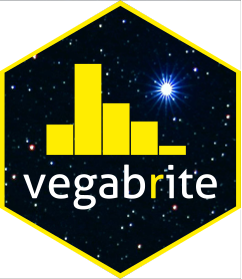

<!-- README.md is generated from README.Rmd. Please edit that file -->

```{r, echo = FALSE}
knitr::opts_chunk$set(
  collapse = TRUE,
  comment = "#>",
  fig.path = "man/figures/README-",
  dev = "svg"
)
```

vegabrite: Iteratively build vega-lite specs in R 
=================================================

<!-- badges: start -->

[](https://github.com/vegawidget/vegabrite/actions)

<!-- badges: end -->


The goal of vegabrite is to provide an R api for building up vega-lite specs. For a guide on getting started using `vegabrite`, check out the [getting started vignette](https://vegawidget.github.io/vegabrite/articles/articles/introduction.html). For some background and context on the package (previously named vegabrite) you can check out [slides](https://docs.google.com/presentation/d/e/2PACX-1vRUDiM3DaPjYP5b1BafSraf8GWwJk_jy6YV_l9lZgeBVwKDSfqiHcTn8M-Qm-6U7frMX7SLqQthJxah/pub?start=false&loop=false&delayms=3000) from a rstudio::conf talk in January 2020.

### Current status

This package is still experimental, but much of the public facing API has been built (although still subject to changes). However, the internals of the package might change substantially to provide greater robustness, make it harder to make invalid specs, and/or provide better information when making invalid spec.

The documentation is also still a work-in-progress, but there is a [getting started vignette](https://vegawidget.github.io/vegabrite/articles/articles/introduction.html). The parameter documentation for functions is fairly complete, however, as it relies on descriptions pulled directly from the Vega-Lite schema. See also an [example gallery](https://vegawidget.github.io/vegabrite/articles/articles/example_gallery.html) for examples of how to make different types of plots.

## Inspiration and related work

The API for this package is heavily inspired by the [vegalite R package](https://github.com/hrbrmstr/vegalite), but is rebuilt from scratch to (1) build up the API semi-automatically based on the Vega-lite schema (an approach inspired by [Altair](https://github.com/altair-viz/altair) and [vega-lite-api](https://github.com/vega/vega-lite-api)) and (2) take advantage of the htmlwidget infrastucture for vega specs provided by the [vegawidget](https://github.com/vegawidget/vegawidget) package.

## Building

Much of the public API is auto-generated via the `build.R` script in the `build` directory. The script makes uses of another package, [vlmetabuildr](https://github.com/vegawidget/vegabrite/tree/master/build/vlmetabuildr) located within the `build` directory. For more about the design see the [design vignette](https://vegawidget.github.io/vegabrite/articles/design.html).

## Examples

These are some examples showing current capabilities; see [examples vignette](https://vegawidget.github.io/vegabrite/articles/articles/examples.html) for more examples, including interactive ones.

```{r example}
library(vegabrite)
vl_chart() %>%
   vl_add_data(values = mtcars) %>%
   vl_mark_point() %>%
   vl_encode_x("wt") %>%
   vl_encode_y("mpg") 
```

```{r example2, warning=FALSE}
vl_chart() %>%
  vl_add_data(url = "https://vega.github.io/vega-editor/app/data/population.json") %>%
  vl_calculate(calculate = "datum.sex == 2 ? 'Female' : 'Male'", 
               as = "gender") %>%
  vl_filter("datum.year == 2000") %>%
  vl_encode(x = "age:O", y = "people:Q", color = "gender:N") %>%
  vl_stack_y("normalize") %>%
  vl_aggregate_y("sum") %>%
  vl_axis_y(title = "population") %>%
  vl_mark_bar() 
```

