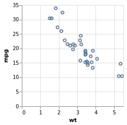
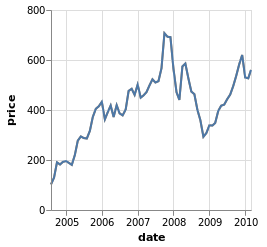

<!-- README.md is generated from README.Rmd. Please edit that file -->


vlbuildr
========

The goal of vlbuildr is to provide an R api for building up vega-lite
specs. This package is in very early stages at the moment… very
incomplete!

Examples
--------

These are some examples showing current capabilities:

``` r
library(vlbuildr)
library(vegawidget)
vl_chart() %>%
   vl_add_data(values = mtcars) %>%
   vl_mark_point() %>%
   vl_encode_x(field = "wt", type = "quantitative") %>%
   vl_encode_y(field = "mpg", type = "quantitative") %>%
   vw_write_png("README-example-1.png")


```


``` r
vl_chart() %>%
    vl_add_data(url = "https://vega.github.io/vega-editor/app/data/stocks.csv") %>%
    vl_transform_filter("datum.symbol==='GOOG'") %>%
    vl_encode_x(field = "date", type = "temporal") %>%
    vl_encode_y(field = "price", type = "quantitative") %>%
    vl_mark_line() %>%
    vw_write_png("README-example2-1.png")


```


