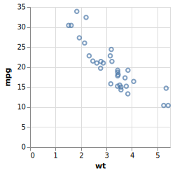

<!-- README.md is generated from README.Rmd. Please edit that file -->

<!-- badges: start -->


[](https://travis-ci.org/vegawidget/vlbuildr)
<!-- badges: end -->

# vlbuildr

The goal of vlbuildr is to provide an R api for building up vega-lite
specs.

### Current status

This package is still experimental, but much of the public facing API
has been built (although still subject to changes). However, the
internals of the package might change substantially to provide greater
robustness, make it harder to make invalid specs, and/or provide better
information when making invalid spec.

The documentation is also still very bare-bones. The parameter
documentation for functions is fairly complete, however, as it relies on
descriptions pulled directly from the Vega-Lite schema.

## Inspiration and related work

The API for this package is heavily inspired by the [vegalite R
package](articles/examples.html), but is rebuilt from scratch to (1)
build up the API semi-automatically based on the Vega-lite schema (an
approach inspired by [Altair](https://github.com/altair-viz/altair) and
[vega-lite-api](https://github.com/vega/vega-lite-api)) and (2) take
advantage of the htmlwidget infrastucture for vega specs provided by the
[vegawidget]() package.

## Building

Much of the public API is auto-generated via the `build.R` script in the
`inst` directory. The script makes uses of another package,
[vlmetabuildr](https://github.com/AliciaSchep/vlmetabuildr).

## Examples

These are some examples showing current capabilities; see [pkgdown
site](https://vegawidget.github.io/vlbuildr/articles/examples.html) for
more examples, including interactive ones.

``` r
library(vlbuildr)
vl_chart() %>%
   vl_add_data(values = mtcars) %>%
   vl_mark_point() %>%
   vl_encode_x("wt") %>%
   vl_encode_y("mpg") 
```

<!-- -->

``` r
vl_chart() %>%
  vl_add_data(url = "https://vega.github.io/vega-editor/app/data/population.json") %>%
  vl_calculate(calculate = "datum.sex == 2 ? 'Female' : 'Male'", 
               as = "gender") %>%
  vl_filter("datum.year == 2000") %>%
  vl_encode(x = "age:O", y = "people:Q", color = "gender:N") %>%
  vl_stack_y("normalize") %>%
  vl_aggregate_y("sum") %>%
  vl_axis_y(title = "population") %>%
  vl_mark_bar() 
```

<!-- -->
